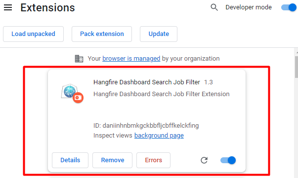

# Hangfire Search Job Extension
 A chrome extension workaround for filtering hangfire jobs on the dashboard.
 
Devido um deficiência da DashBoard do HangFire por um filtro de pesquisa para os Jobs.
Essa Extensão do Chrome “HangFire Search Job” que possibilita realizar filtros pelo nome do Jobs, limitando a pesquisa dentro numero de itens num total de pagina.
 <h1 align="left">

</h1>

# Installation
<h3>Acesse a aba de gerenciamento de extensões</h3>

Abra o Google Chrome, clique no ícone de “Quebra-cabeça” e, no menu aberto, selecione “<a href="chrome://extensions/">Manage extensions</a>”.
 <h1 align="left">

</h1>

<h3>Ative o modo de desenvolvedor</h3>
Habilite a opção “Develop Mode” no canto superior direito.

<h3>Instale a extensão manualmente</h3>

De volta à aba “Manage extensions”, clique em “Load Unpacked”, 
localize a pasta em seu PC com os arquivos descompactados, marque-a e clique em “Selecionar pasta”.
Feito isso, a extensão será devidamente instalada.

 <h1 align="left">
 
 </h1>

<h3>Use a extensão normalmente</h3>

Feito isso, a extensão ficará disponível e poderá ser utilizada normalmente no navegador.
<h1 align="left">
 
</h1>

# Autor
Thiago Franklin Miranda Reis 
[tfmreis@gmail.com](mailto:tfmreis@gmail.com)

# Licence
This example application is [MIT Licensed](https://github.com/tfmreis/HangfireSearchJob/blob/main/LICENSE)

